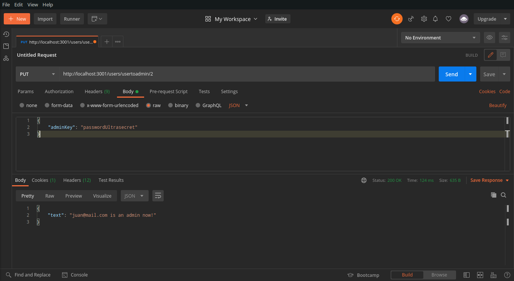

# CHARGER

Proyecto realizado en la cursada de la bootcamp Soy Henry, realizada en un equipo de 5 personas utilizando la metodologia Scrum.

## Tecnologias usadas

### Frontend
- React hooks
- Redux
- Material UI
- Axios

### Backend
- Nodejs
- Express
- Sequelize (PostgreSQL)
- Mailgun
- Passport

## ¿Como correr el proyecto?
1. Crea una cuenta en [Mailgun](https://www.mailgun.com)
2. Buscar la Private Key y el dominio del email. *Más abajo hay un ejemplo de como deberían ser*
3. Crea una base de datos en PostgreSQL con un nombre a eleccion. En este ejemplo le pondremos "development". Se crea con el siguiente comando: `CREATE DATABASE development;`
4. Crea un archivo dentro de la carpeta "api" llamado `.env` con el siguiente contenido:
```
DB_NAME=development
DB_HOST=localhost
DB_USER=usuariopostgres
DB_PASSWORD=TuContraseña12345
EMAIL_DOMAIN=sandbox(seriedenumerosyletras).mailgun.org
EMAIL_API_KEY=privatekeydemailgun
ADMIN_KEY=passwordUltrasecret
```
5. Posicionate en la carpeta `api` y ejecuta el comando `npm install`
6. Posicionate en la carpeta `client` y ejecuta el comando `npm install`
7. Correr los servers
8. Abrí dos consolas
9. En una consola posicionate en la carpeta `api` y ejecuta el comando `npm start`
10. En la otra consola, posicionate en la carpeta `client` y ejecuta el comando `npm start`

## ¿Como puedo ser admin?
Al entrar a la página, verás que no hay ningun producto cargado. Para poder tener productos, tenemos que crear un usario administrador, a través de los siguientes pasos podemos lograrlo sin ningun inconveniente:

1. Nos posicionamos en el HOME PAGE
2. Damos click en la parte de LOGIN (*barra de navegación*)
3. Nos registramos en Charger con los datos que querramos, no se valida si es un email válido o no
4. Una vez registrados, iniciamos sesion en la cuenta.
5. Para poder setear un administrador necesitamos hacerlo a través de una URL con [Postman](https://www.postman.com/)

### Pasos en Postman

1. Abrimos Postman
2. Abrimos una nueva petición con el método PUT
3. Colocamos la URL *http://localhost:3001/users/usertoadmin/1*
4. Dentro de la opción Body, seleccionamos la opción "raw". Mas a la derecha hay una opción para elegir el estilo del texto, ponemos JSO
5. Luego colocamos el siguiente texto en el campo:
```
{
    "adminKey": "passwordUltrasecret"
}
```
5. Solo queda darle Send para que nuestro usuario ahora tenga permisos de administrador y refrescar la página.
6. Debería quedar algo así :point_down:
  


## ¿Qué puedo hacer como administrador? ¿Cómo lo hago?
Siendo administradores tenemos acceso a muchas funcionalidades de la página, tal como agregar/modificar/eliminar productos, hasta ver todos los usuarios registrados.

### Cargar productos y categorías
  1. Nos dirigimos al menu hamburguesa de la barra de navegación
  2. Hacemos click en la sección de ADMIN, se nos va a abrir una sección especial que contiene:
  ```
  Una barra de navegación: Acá tenemos acceso a todas las funcionalidades del Administrador
  Sección: Cada sección contiene las funcionalidades correspondientes a su nombre
  ```
  3. Vamos a la sección CREATE PRODUCTS
  4. Llenamos el formulario con los datos que nos pide:
  ```
  
  ```

## Nosotros

Somos un grupo de 5 estudiantes de [Soy Henry](https://www.soyhenry.com/). Estas son nuestras cuentas de GitHub:

- [Juan Cruz Lescano](https://github.com/JuanCruzLescano)
- [Juan Pablo Martinez](https://github.com/Jotap29)
- [Mauricio Nicolas Cruz](https://github.com/maunicols)
- [Federico Leiva](https://github.com/FedericoLeiva12)
- [Manuel Beleño](https://github.com/msebass1)
